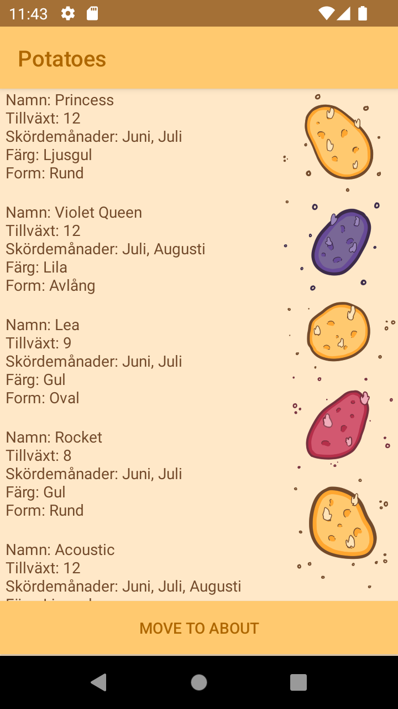
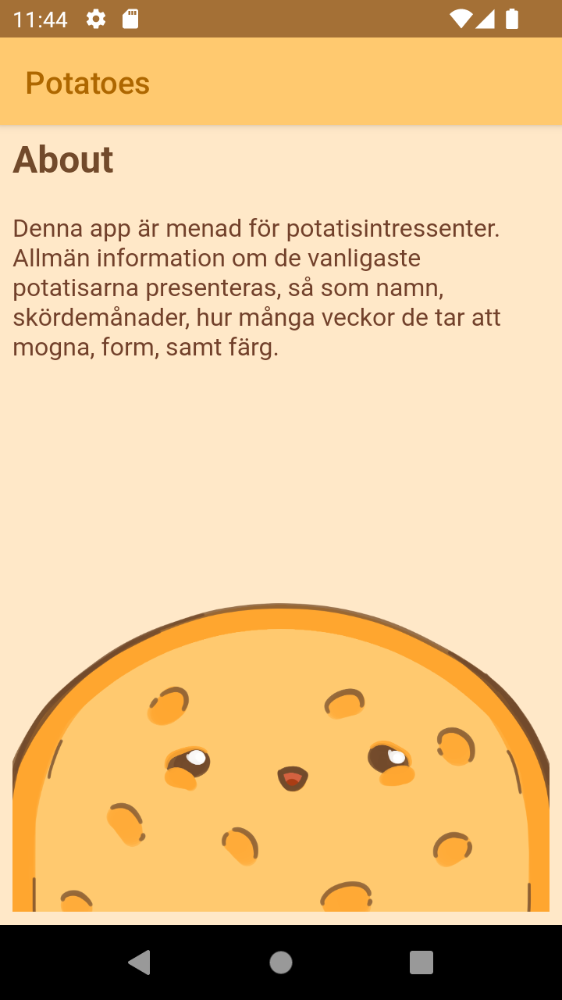

# Rapport

**Eftersom det inte var ett krav på en rapport, är denna ofullstäldig. appen funkar dock som den ska.**

**Webbtjänst - JSON**

Data skrevs in i webbtjänsten som vi fått, admingränssnittet, där datan applicerades på den 
rubrik som innehöll den datatyp som passade. exempelvis sattes mognadstid till size, även om den
inte explicivt passar under rubriken, då datatypen passade. Detta eftersom vi oavsätt kommer ändra 
namnet på deras koppling, och ersätta size med exempelvis mognadstid i presentationen på appen.

**Övrig text om implementationen**
Lade till en recyclerview i activity_main. Tog även bort textviewn som fanns där vid forkningen 
av appen.
```
<androidx.recyclerview.widget.RecyclerView
android:id="@+id/recycler_view"
android:layout_width="match_parent"
android:layout_height="match_parent"
app:layout_constraintBottom_toBottomOf="parent"
app:layout_constraintLeft_toLeftOf="parent"
app:layout_constraintRight_toRightOf="parent"
app:layout_constraintTop_toTopOf="parent" />
```
Skapar en ny layout, recyclerviewitem, som innehåller en textview. Detta genom Layout > new > Layout
Resource File, där jag även gjorde denna till en Linear Layout.

Lade till en ny class, RecyclerViewAdapter, som används som en adapter för RecyclerViewn. I denna 
lade jag till koden som finns på canvas, som jag modifierade för att passa mitt specifika project.

Eftersom vi använder dem datanamn som finns i admingränssnittet, ändrar jag namnen på variablerna via
SerializedName. Detta för att bättre passa den data som jag valt, som är potatisar. Ett exempel kan ses
i koden nedan.
```
@SerializedName("name")
private String title;
```
Skapade en JsonTask class, som vi pastear in koden ifrån canvas på.

Lade till så att MainActivity implementerar JsonTask.JsonTaskListener, vilket också gav oss metoden
onPostExecute.

Därefter lade vi till en "UpdateData" i RecyclerViewAdapter, som ska hantera all uppdatering av datan
genom koden nedan
```
items.clear();
items.addAll(newRecyclerItemList);
notifyDataSetChanged();
```
Fixade så att namnen överänsstämde admingränssnittets namn, vilket gav oss rätt information på sidan.

Lade till en knapp, som jag sedan anpassade recyclerview till genom constraints. Detta gjorde att 
recyclerview håller sig under knappen. Jag märkte dock att recyclerview kapar av viss text i slutet,
vilket jag fixade genom att sätta en padding på "bottom".

```
    <Button
        android:layout_width="match_parent"
        android:layout_height="wrap_content"
        tools:ignore="MissingConstraints"
        android:text="ABOUT"
        android:id="@+id/aboutButton"
        app:layout_constraintTop_toTopOf="parent"
        app:layout_constraintLeft_toLeftOf="parent"
        app:layout_constraintRight_toRightOf="parent" />
```
```
    <androidx.recyclerview.widget.RecyclerView
        ...
        android:paddingBottom="40dp"
        app:layout_constraintTop_toBottomOf="@+id/aboutButton"
        ... />
```
Lade till en WebView i oncreate i activity_Second, vilket innebär att webviewn startas så snart 
activity_second körs, vilket därmed visar aboutme-sidan. Jag skapade även en WebView widget 
(igentligen först)
```
<WebView
android:id="@+id/my_WebView"
android:layout_width="match_parent"
android:layout_height="match_parent"
/>
```

```
WebView myWebView;

        public void showInternalWebPage() {
            // TODO: Add your code for showing internal web page here
            myWebView.loadUrl("file:///android_asset/about.html");
        }
```


**Implementationsexempel**

 // Implementationsexempel finns med i dem inlämnade slidesen, men inkluderas även nedan.



